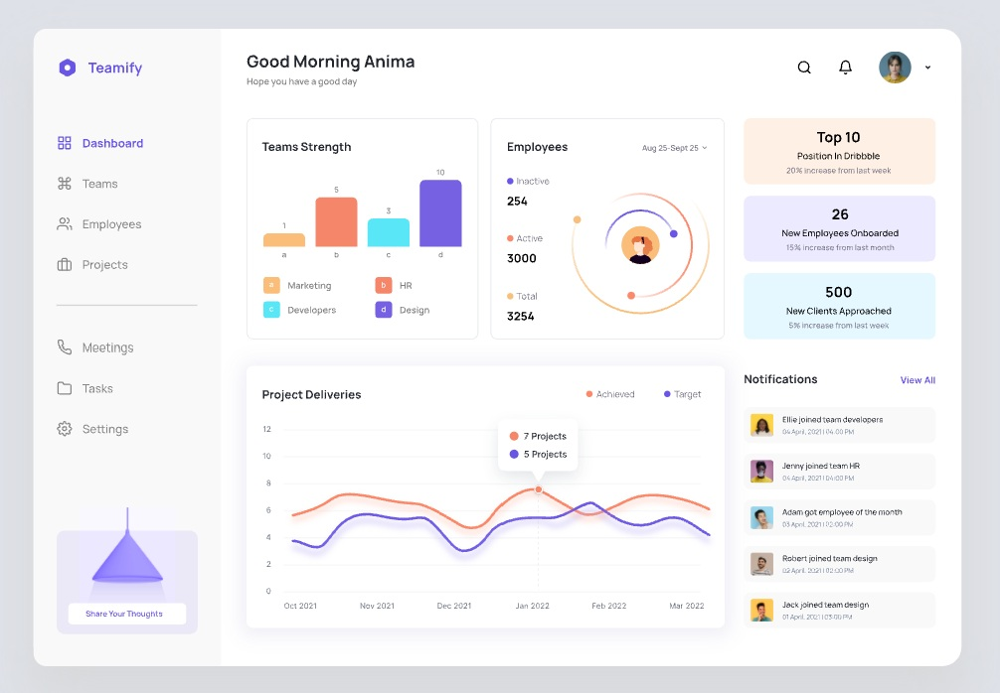

#  Teamify dashboard

## Overview


[Live site](https://lefrolg.github.io/teamify/)

Design:


Implemented Features:

- Figma design translation: partially converted the Figma design into a website using PrimeVue and Tailwind CSS, closely matching the original design.
- Dynamic routing: implemented a routing system to navigate between various dashboard views.
- Interactive search input: developed a search input that activates when clicking the search icon, complete with autofocus for an enhanced user experience.
- Notification system: built a notifications counter and popover with the ability to remove notifications, all managed through a Pinia store.
- Team Strength Chart: created and styled a bar chart using Chart.js with a legend and additional labels with values.
- Preloader: : implemented a skeleton loader for the Team Strength Chart to ensure a smoother user experience during data loading.
- Employee Activity Chart: implemented an Employee Activity chart with a creative, custom solution.


## Tech Stack

- [Vue.js](https://vuejs.org/) - The Progressive JavaScript Framework
- [Pinia](https://pinia.vuejs.org/) - The store library for Vue for State Management
- [Vue Router](https://router.vuejs.org/) - The official Router for Vue.js
- [PrimeVue](https://primevue.org/) - The Ultimate Vue UI Component Library
- [TailwindCSS](https://tailwindcss.com/) - A utility-first CSS framework
- [Vite](https://vitejs.dev/) - Next Generation Frontend Tooling
- [Chart.js](https://www.chartjs.org/) - Simple yet flexible JavaScript charting

## Getting Started

1. Clone the repository:

```bash
git clone https://github.com/lefrolg/teamify.git
```

2. Install dependencies:

```bash
npm install
```

3. Start the development server:

```bash
npm run dev
```

4. Build for production:

```bash
npm run build
```

## Project Structure

```
vite-tailwindv4/
├── src/
│   ├── components/         # Vue components
│   ├── assets/            # Static assets
│   ├── router/            # App router
│   ├── views/             # App pages
│   ├── utils/             # Helpers
│   └── App.vue            # Root component
├── public/                # Public static assets
├── index.html            # Entry HTML file
└── vite.config.js        # Vite configuration
```
